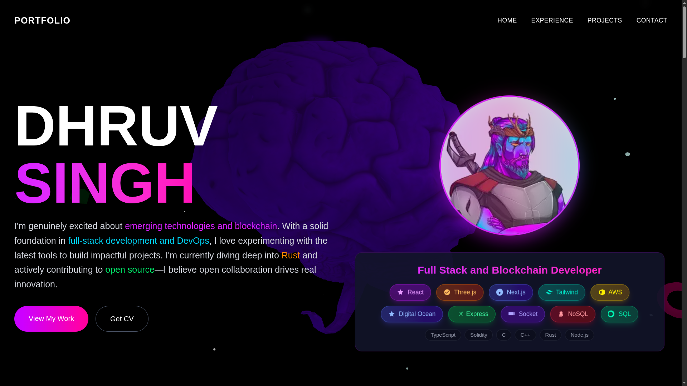
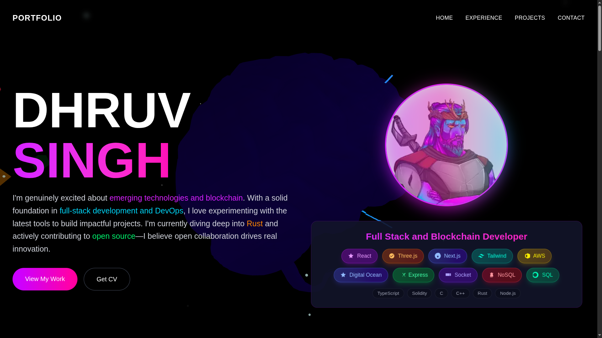
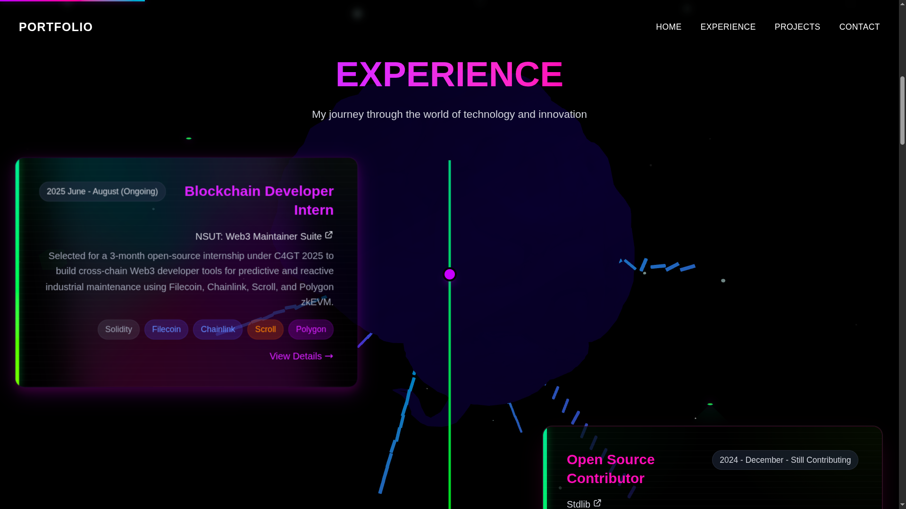
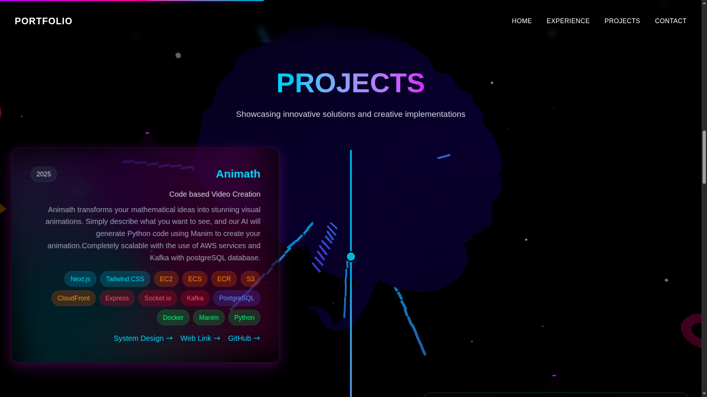
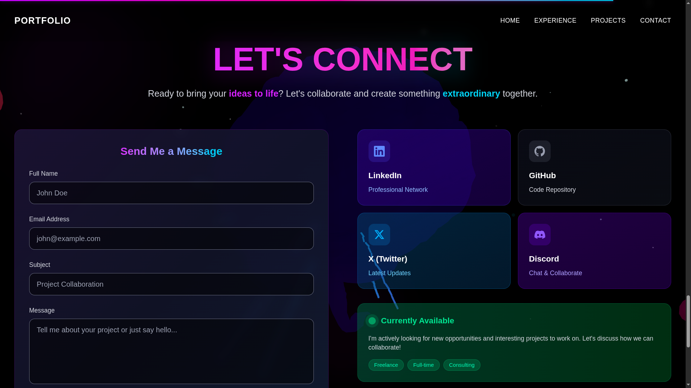

# Dhruv Singh's Portfolio

This repository contains the source code for Dhruv Singh's personal portfolio website.

Link: [https://portfolio.dsingh.fun](https://portfolio.dsingh.fun)

## About Dhruv Singh

[**Note to Dhruv Singh:** Please add a brief summary about yourself and your achievements here.]

## How the Website is Built

This portfolio is a [Next.js](https://nextjs.org/) application, bootstrapped with [`create-next-app`](https://github.com/vercel/next.js/tree/canary/packages/create-next-app). It is styled with [Tailwind CSS](https://tailwindcss.com/) and uses [TypeScript](https://www.typescriptlang.org/).

The project has the following structure:

-   `src/app/`: This directory contains the main application logic, including the layout and pages.
-   `src/components/`: This directory contains the reusable React components used throughout the website.
-   `public/`: This directory contains static assets such as images and 3D models.
-   `next.config.ts`: This file contains the configuration for the Next.js application.
-   `package.json`: This file lists the project dependencies and scripts.

The website is deployed on [Google Cloud Platform (GCP) Compute Engine](https://cloud.google.com/compute).

## Screenshots

Here are some screenshots of the website:

